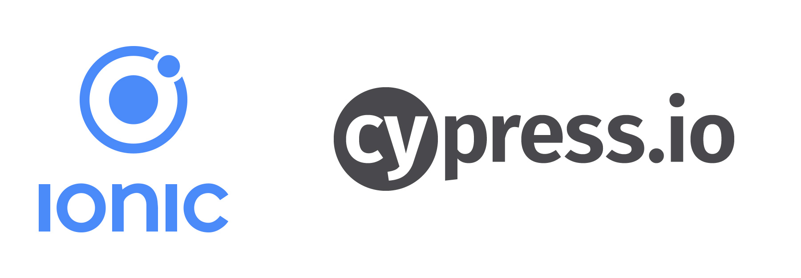

# IonicCypress

Sample project that shows how to integrate & use Cypress in Ionic app.

Technologies: Cypress, Ionic, TypeScript.



## Considerations

Currently cypress not support shadow dom and this issue is known by more than 2.5 years (https://github.com/cypress-io/cypress/issues/144).

To test shadow dom it is necessary to use [cypress-shadow-dom package](https://github.com/abramenal/cypress-shadow-dom).

### cypress-shadow-dom

Extend Cypress commands with shadow DOM support.

This package adds a custom Cypress command that allows you to make an abstraction on how exactly you upload files through you HTML controls and focus on testing the functionality.

## Cypress E2E tests

Tests are located in cypress/integration/home folder.

Example test

```bash
    it('Button is enabled when input is not empty', () => {
        cy.get('ion-button')
        .should('have.attr', 'disabled')
        .shadowGet('ion-item') // Querying shadow DOM elements using cypress-shadow-dom package
        .get('ion-input')
        .get('input')
        .type('SomeText')
        .get('ion-button')
        .should('not.have.attr', 'disabled');
    });
```

## Running

Before you go through this example, you should have at least a basic understanding of Ionic concepts. You must also already have Ionic installed on your machine.

* Test in localhost:

To run it, cd into `ionic-cypress` and run:

```bash
npm install
ionic serve
```

To run the e2e cypress tests open new terminal and run:

```bash
npm run cypress
```

## Requirements

* [Node.js](http://nodejs.org/)
* [Ionic](https://ionicframework.com/getting-started#cli)
* [Cypress](https://www.cypress.io/)
